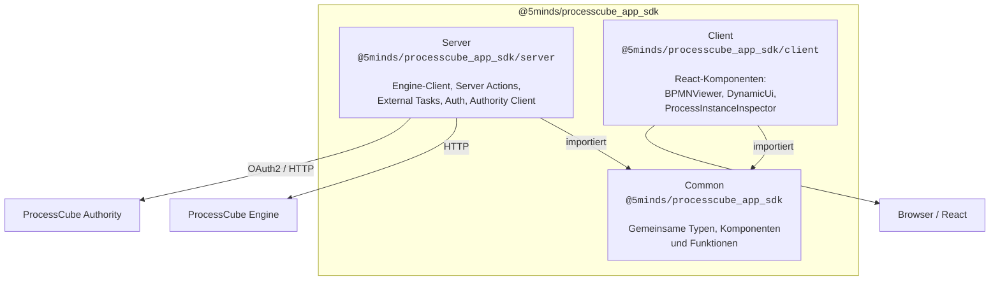
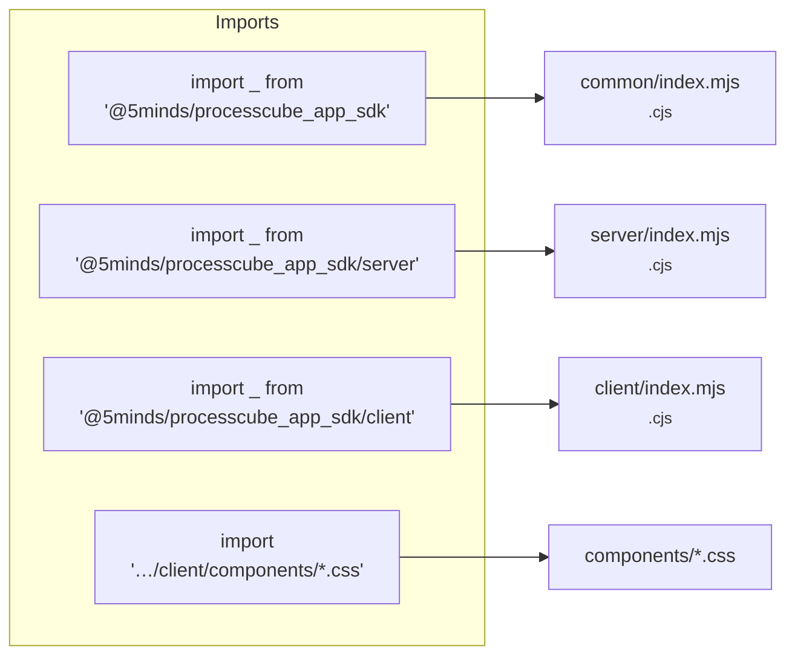
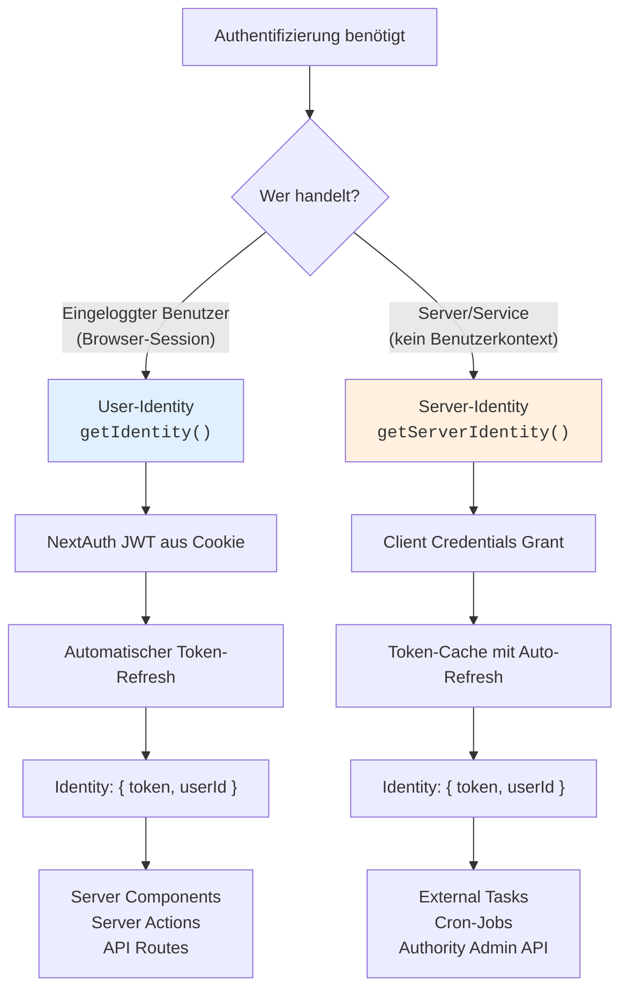
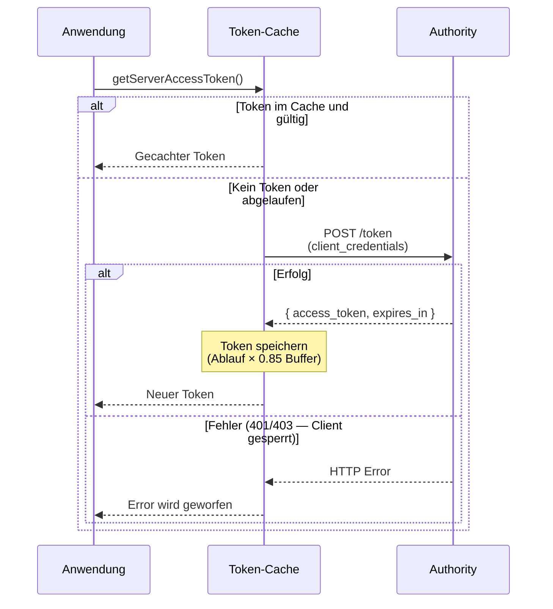
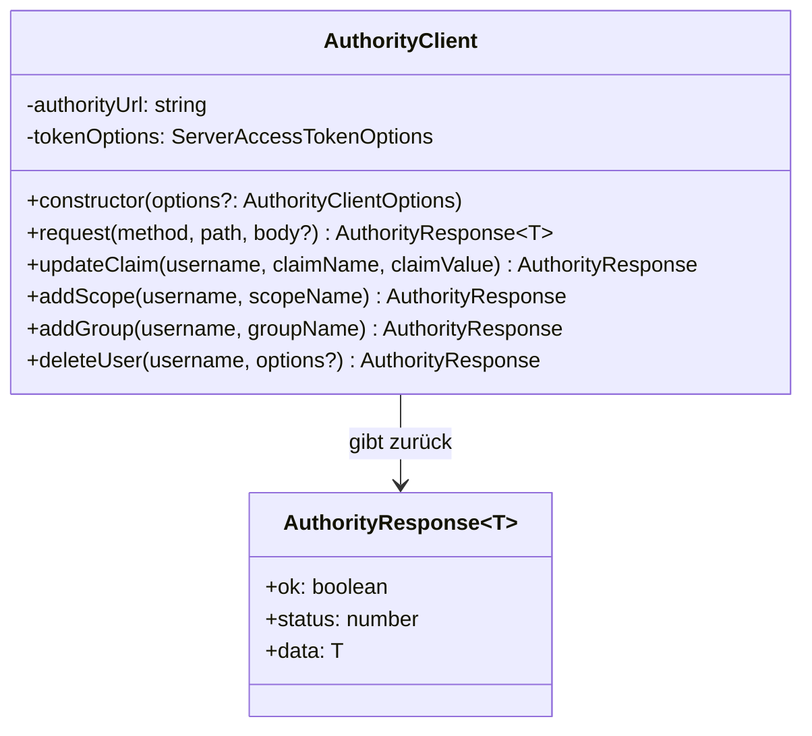
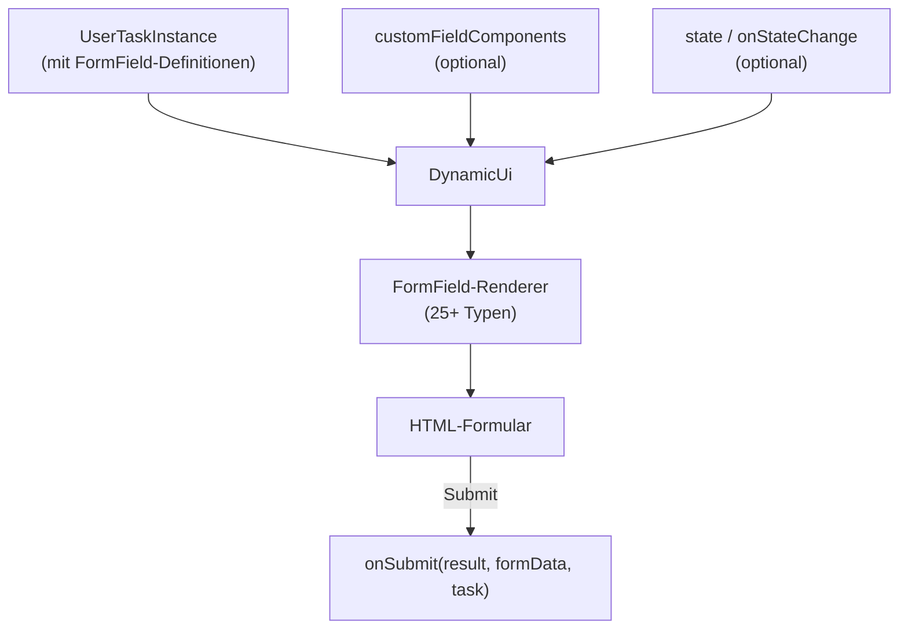
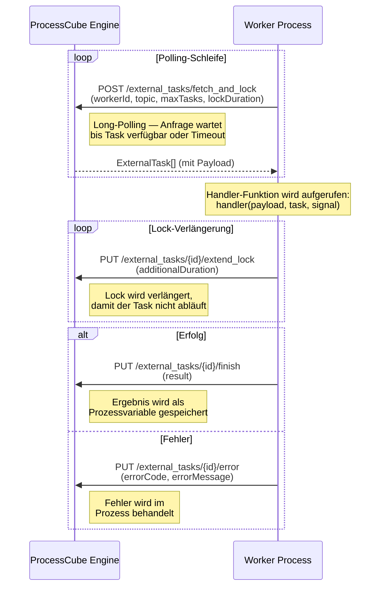
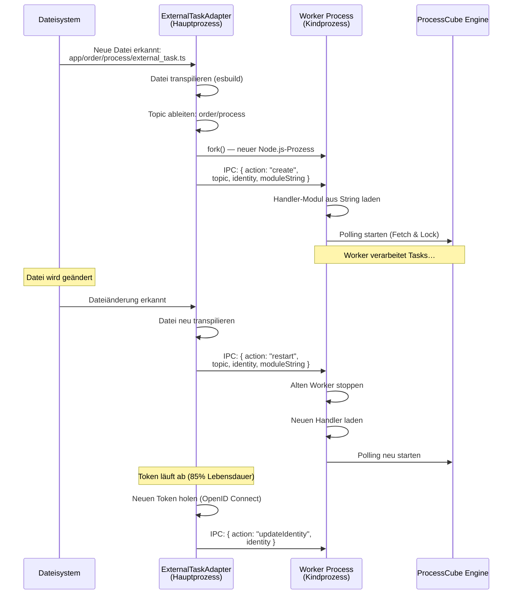
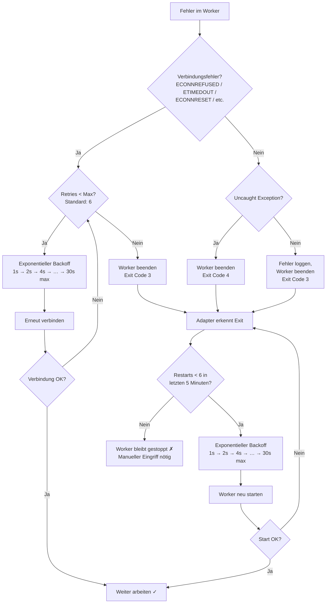
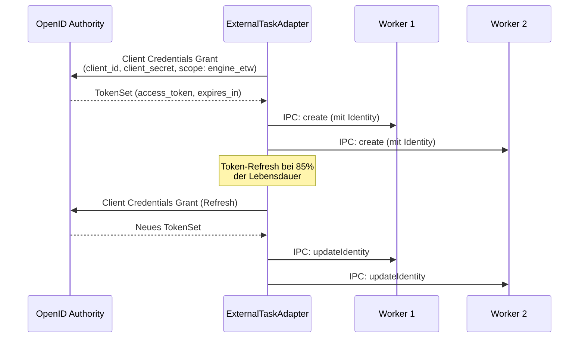

# ProcessCube App SDK

Das `@5minds/processcube_app_sdk` ist ein TypeScript-SDK zur Entwicklung von ProcessCube-Anwendungen mit [Next.js](https://nextjs.org/). Es stellt React-Komponenten, Server-Funktionen und gemeinsam genutzte Utilities für Prozessvisualisierung (BPMN), dynamische Formulare und die Integration mit der ProcessCube-Engine bereit.

## Überblick

### Features

- **Next.js 15+** App Router mit React 19 Server Components
- **Vollständig typisiert** durch TypeScript-Support
- **OAuth 2.0 Authentifizierung** via Authority-Integration (NextAuth + Client Credentials)
- **Ready-to-use React-Komponenten** für BPMN-Viewer, Prozess-Inspektion und dynamische Formulare
- **Sichere Engine-Kommunikation** über Server-Side Functions und Server Actions
- **Automatische Worker-Registrierung** für External Tasks
- **Authority Client** für Server-to-Server User-Administration

### Architektur

Das SDK hat eine Drei-Schichten-Modulstruktur mit strikter Trennung:



### Export-Map

Das Paket hat drei Einstiegspunkte — jeder mit ESM- und CJS-Support:



| Import-Pfad                          | Inhalt                                                                    | Umgebung        |
| ------------------------------------ | ------------------------------------------------------------------------- | --------------- |
| `@5minds/processcube_app_sdk`        | Gemeinsame Typen, `RemoteUserTask`, `hasClaim`, Auth-Callbacks            | Client + Server |
| `@5minds/processcube_app_sdk/server` | Engine-Funktionen, Server Actions, Auth, Authority Client, External Tasks | Nur Server      |
| `@5minds/processcube_app_sdk/client` | React-Komponenten (BPMNViewer, DynamicUi, ProcessInstanceInspector, …)    | Nur Client      |
| `…/client/components/*.css`          | Komponent-spezifische Stylesheets                                         | CSS-Import      |

## Installation

### Voraussetzungen

- Node.js >= 24
- Next.js >= 15
- React >= 19

### Paket installieren

```bash
npm install @5minds/processcube_app_sdk
```

### Next.js konfigurieren

Die einfachste Konfiguration mit dem SDK-Plugin:

```typescript
// next.config.ts
import { withApplicationSdk } from '@5minds/processcube_app_sdk/server';

export default withApplicationSdk({
  applicationSdk: {
    useExternalTasks: true,
  },
});
```

Ohne External Tasks reicht:

```typescript
// next.config.ts
import type { NextConfig } from 'next';

const nextConfig: NextConfig = {
  serverExternalPackages: ['esbuild'],
};

export default nextConfig;
```

### CSS einbinden

Client-Komponenten bringen eigene Stylesheets mit, die im Layout oder auf der Seite importiert werden müssen:

```typescript
// Beispiel: ProcessInstanceInspector CSS
import '@5minds/processcube_app_sdk/client/components/ProcessInstanceInspector/ProcessInstanceInspector.css';
import '@5minds/processcube_app_sdk/client/components/BPMNViewer.css';
```

### Umgebungsvariablen

Erstelle eine `.env.local` im Projekt-Root:

```bash
# Pflicht
PROCESSCUBE_ENGINE_URL=http://localhost:10560

# Für Authentifizierung (optional)
PROCESSCUBE_AUTHORITY_URL=http://localhost:11560
NEXTAUTH_CLIENT_ID=my_client_id
NEXTAUTH_SECRET=my_secret
```

Die vollständige Liste aller Umgebungsvariablen findest du im Abschnitt [Konfiguration](#konfiguration).

## Authentifizierung

Das SDK bietet zwei Authentifizierungs-Strategien für unterschiedliche Anwendungsfälle:



### User-Identity (NextAuth-basiert)

Für Server Components und Server Actions, die im Kontext eines eingeloggten Benutzers laufen:

#### getIdentity()

Gibt die Identity des aktuell eingeloggten Benutzers zurück. Nutzt das NextAuth-JWT aus dem Session-Cookie.

```typescript
import { getIdentity } from '@5minds/processcube_app_sdk/server';

export default async function MyPage() {
  const identity = await getIdentity();
  // identity.token  — Access Token
  // identity.userId — User ID (sub Claim)
}
```

Der Token wird automatisch erneuert, wenn er abgelaufen ist. Voraussetzung: `PROCESSCUBE_AUTHORITY_URL`, `NEXTAUTH_CLIENT_ID` und `NEXTAUTH_SECRET` sind gesetzt.

#### hasClaim()

Prüft, ob der aktuelle Benutzer einen bestimmten Claim besitzt. Funktioniert sowohl in Server Components als auch im Client.

```typescript
import { hasClaim } from '@5minds/processcube_app_sdk';

const isAdmin = await hasClaim('admin');
```

#### Auth-Callbacks für NextAuth

Das SDK exportiert vorkonfigurierte Callbacks für die NextAuth-Konfiguration:

```typescript
import { authConfigJwtCallback, authConfigSessionCallback } from '@5minds/processcube_app_sdk';

export const authOptions = {
  callbacks: {
    jwt: authConfigJwtCallback,
    session: authConfigSessionCallback,
  },
  // ... weitere NextAuth-Konfiguration
};
```

| Callback                    | Aufgabe                                                                                                 |
| --------------------------- | ------------------------------------------------------------------------------------------------------- |
| `authConfigJwtCallback`     | Überträgt Access Token, ID Token und Refresh Token in das JWT. Erneuert abgelaufene Tokens automatisch. |
| `authConfigSessionCallback` | Extrahiert Claims aus dem Access Token und stellt sie in `session.user.claims` bereit.                  |

### Server-Identity (Client Credentials)

Für Server-to-Server-Kommunikation ohne Benutzerkontext — typischerweise in External Tasks, Cron-Jobs oder Authority-Admin-Operationen:

#### getServerAccessToken()

Holt einen Access Token über den OAuth2 Client Credentials Grant. Der Token wird gecacht und automatisch vor Ablauf erneuert.

```typescript
import { getServerAccessToken } from '@5minds/processcube_app_sdk/server';

const token = await getServerAccessToken();
```



**Optionen:**

```typescript
interface ServerAccessTokenOptions {
  clientId?: string; // Default: PROCESSCUBE_SERVER_CLIENT_ID
  clientSecret?: string; // Default: PROCESSCUBE_SERVER_CLIENT_SECRET
  scopes?: string; // Default: PROCESSCUBE_SERVER_SCOPES oder 'upe_admin engine_read engine_write'
  authorityUrl?: string; // Default: PROCESSCUBE_AUTHORITY_URL
  skipCache?: boolean; // Cache umgehen und frischen Token holen
}
```

#### getServerIdentity()

Wrapper um `getServerAccessToken()`, der direkt ein `Identity`-Objekt zurückgibt:

```typescript
import { getServerIdentity } from '@5minds/processcube_app_sdk/server';

const identity = await getServerIdentity();
// identity.token  — Access Token
// identity.userId — Service-Account User ID
```

### Authority Client

Der `AuthorityClient` bietet authentifizierten Zugriff auf die ProcessCube Authority API — in zwei Stufen:



#### Stufe 1 — Allgemein: request()

Für beliebige Authority-API-Aufrufe. Der Token wird automatisch beschafft und als Cookie gesendet:

```typescript
import { AuthorityClient } from '@5minds/processcube_app_sdk/server';

const authority = new AuthorityClient();

// Beliebiger API-Aufruf
const response = await authority.request('GET', '/acr/username_password/admin/users');
if (response.ok) {
  console.log(response.data);
}
```

#### Stufe 2 — Convenience-Methoden

Vordefinierte Methoden für häufige User-Admin-Operationen:

```typescript
import { AuthorityClient } from '@5minds/processcube_app_sdk/server';

const authority = new AuthorityClient();

// Claim setzen
await authority.updateClaim('user@example.com', 'email_verified', true);

// Scope hinzufügen
await authority.addScope('user@example.com', 'premium_content');

// Gruppe zuweisen
await authority.addGroup('user@example.com', 'Partner-Netzwerk');

// User soft-deleten
const result = await authority.deleteUser('user@example.com', { fullDelete: false });
```

| Methode                                        | HTTP   | Beschreibung                           |
| ---------------------------------------------- | ------ | -------------------------------------- |
| `updateClaim(username, claimName, claimValue)` | PATCH  | Setzt einen Claim auf dem User-Account |
| `addScope(username, scopeName)`                | PATCH  | Fügt einen Scope zum User hinzu        |
| `addGroup(username, groupName)`                | PATCH  | Fügt den User einer Gruppe hinzu       |
| `deleteUser(username, { fullDelete? })`        | DELETE | Löscht oder soft-deleted einen User    |

Alle Methoden geben ein `AuthorityResponse<T>` zurück mit `ok`, `status` und `data`.

#### Beispiel: External Task mit Authority Client

Vorher (ohne SDK-Helper):

```typescript
export default async function (payload: any) {
  const response = await fetch(`${process.env.PROCESSCUBE_AUTHORITY_URL}/token`, {
    method: 'POST',
    headers: { 'Content-Type': 'application/x-www-form-urlencoded' },
    body: new URLSearchParams({
      grant_type: 'client_credentials',
      client_id: process.env.PROCESSCUBE_SERVER_CLIENT_ID,
      client_secret: process.env.PROCESSCUBE_SERVER_CLIENT_SECRET,
      scope: 'upe_admin engine_read engine_write',
    }).toString(),
  });
  const { access_token } = await response.json();

  const result = await fetch(`${process.env.PROCESSCUBE_AUTHORITY_URL}/acr/username_password/admin/user/${payload.email}/delete`, {
    method: 'DELETE',
    headers: { Cookie: `access_token=${access_token}`, 'Content-Type': 'application/json' },
    body: JSON.stringify({ fullDelete: false }),
  });
  return { completed_successful: result.ok };
}
```

Nachher (mit Authority Client):

```typescript
import { AuthorityClient } from '@5minds/processcube_app_sdk/server';

export default async function (payload: any) {
  const authority = new AuthorityClient();
  const result = await authority.deleteUser(payload.email, { fullDelete: false });
  return { completed_successful: result.ok };
}
```

## Konfiguration

### withApplicationSdk Plugin

Das SDK-Plugin für Next.js konfiguriert die Anwendung automatisch und startet bei Bedarf External Task Worker:

```typescript
import { withApplicationSdk } from '@5minds/processcube_app_sdk/server';

export default withApplicationSdk({
  applicationSdk: {
    useExternalTasks: true,
    customExternalTasksDirPath: './my-tasks', // Optional
  },
  // Weitere Next.js-Optionen hier
});
```

| Option                       | Typ       | Standard                 | Beschreibung                          |
| ---------------------------- | --------- | ------------------------ | ------------------------------------- |
| `useExternalTasks`           | `boolean` | `false`                  | External Task Worker aktivieren       |
| `customExternalTasksDirPath` | `string`  | `./app` oder `./src/app` | Verzeichnis für External Task Handler |

Das Plugin fügt automatisch `esbuild` zu `serverComponentsExternalPackages` hinzu und startet Worker nur im Server-Modus (nicht während `next build`).

### Umgebungsvariablen

#### Allgemein

| Variable                    | Pflicht | Standard                 | Beschreibung                                                               |
| --------------------------- | ------- | ------------------------ | -------------------------------------------------------------------------- |
| `PROCESSCUBE_ENGINE_URL`    | Nein    | `http://localhost:10560` | URL der ProcessCube Engine                                                 |
| `PROCESSCUBE_AUTHORITY_URL` | Nein    | —                        | URL der ProcessCube Authority. Aktiviert Token-basierte Authentifizierung. |

#### User-Identity (NextAuth)

| Variable             | Pflicht        | Standard    | Beschreibung                                 |
| -------------------- | -------------- | ----------- | -------------------------------------------- |
| `NEXTAUTH_CLIENT_ID` | Wenn Authority | —           | OAuth2 Client ID für den Benutzer-Login      |
| `NEXTAUTH_SECRET`    | Wenn Authority | —           | Secret für NextAuth JWT-Verschlüsselung      |
| `NEXTAUTH_URL`       | Nein           | Auto-Detect | URL der NextAuth-Instanz (für Token-Refresh) |

#### Server-Identity (Client Credentials)

| Variable                           | Pflicht              | Standard                             | Beschreibung                               |
| ---------------------------------- | -------------------- | ------------------------------------ | ------------------------------------------ |
| `PROCESSCUBE_SERVER_CLIENT_ID`     | Wenn Server-Identity | —                                    | OAuth2 Client ID für Server-to-Server Auth |
| `PROCESSCUBE_SERVER_CLIENT_SECRET` | Wenn Server-Identity | —                                    | OAuth2 Client Secret                       |
| `PROCESSCUBE_SERVER_SCOPES`        | Nein                 | `upe_admin engine_read engine_write` | Scopes für den Server-Token                |

#### External Task Worker

| Variable                                         | Pflicht        | Standard | Beschreibung                                   |
| ------------------------------------------------ | -------------- | -------- | ---------------------------------------------- |
| `PROCESSCUBE_EXTERNAL_TASK_WORKER_CLIENT_ID`     | Wenn Authority | —        | Client ID für External Task Worker Auth        |
| `PROCESSCUBE_EXTERNAL_TASK_WORKER_CLIENT_SECRET` | Wenn Authority | —        | Client Secret für External Task Worker Auth    |
| `PROCESSCUBE_APP_SDK_ETW_RETRY`                  | Nein           | `6`      | Max. Reconnect-Versuche bei Verbindungsfehlern |

## Server-Funktionen

### Übersicht

Alle Server-Funktionen werden aus `@5minds/processcube_app_sdk/server` importiert und können in Server Components, Server Actions und API Routes verwendet werden.

| Kategorie             | Funktionen                                                                                                                                                                                                                                                                                                                                                         |
| --------------------- | ------------------------------------------------------------------------------------------------------------------------------------------------------------------------------------------------------------------------------------------------------------------------------------------------------------------------------------------------------------------ |
| **Authentifizierung** | `getIdentity`, `getServerAccessToken`, `getServerIdentity`                                                                                                                                                                                                                                                                                                         |
| **Authority**         | `AuthorityClient`                                                                                                                                                                                                                                                                                                                                                  |
| **Process-Instanzen** | `getProcessInstanceById`, `getActiveProcessInstances`, `retryProcessInstance`, `terminateProcessInstance`, `waitForProcessEnd`, `getFlowNodeInstancesByProcessInstanceId`, `getFlowNodeInstancesTriggeredByFlowNodeInstanceIds`                                                                                                                                    |
| **User Tasks**        | `getUserTasks`, `getWaitingUserTasks`, `getWaitingUserTasksByProcessInstanceId`, `getWaitingUserTasksByFlowNodeId`, `getWaitingUserTaskByFlowNodeInstanceId`, `getWaitingUserTasksByCorrelationId`, `getReservedUserTasksByIdentity`, `getAssignedUserTasksByIdentity`, `waitForUserTask`, `finishUserTaskAndGetNext`, `reserveUserTask`, `cancelReservedUserTask` |
| **Server Actions**    | `startProcess`, `finishUserTask`, `finishManualTask`, `finishUntypedTask`, `finishTask`, `navigateToUrl`                                                                                                                                                                                                                                                           |
| **Engine**            | `getEngineClient`                                                                                                                                                                                                                                                                                                                                                  |
| **Plugin**            | `withApplicationSdk`                                                                                                                                                                                                                                                                                                                                               |
| **External Tasks**    | `ExternalTaskConfig` (Type)                                                                                                                                                                                                                                                                                                                                        |

### Process-Instanzen

#### getProcessInstanceById

Gibt die Prozessinstanz mit der angegebenen ID zurück (inkl. BPMN-XML).

```typescript
import { getProcessInstanceById } from '@5minds/processcube_app_sdk/server';

const instance = await getProcessInstanceById('process-instance-id');
```

#### getActiveProcessInstances

Gibt alle laufenden Prozessinstanzen zurück. Unterstützt Filterung und Paginierung.

```typescript
import { getActiveProcessInstances } from '@5minds/processcube_app_sdk/server';

// Alle laufenden Instanzen
const result = await getActiveProcessInstances();

// Mit Filter
const filtered = await getActiveProcessInstances({
  query: { processModelId: 'OrderProcess' },
  options: { limit: 10, offset: 0 },
});
```

#### retryProcessInstance

Startet eine Prozessinstanz von einem bestimmten FlowNode neu.

```typescript
import { retryProcessInstance } from '@5minds/processcube_app_sdk/server';

// Gesamten Prozess neu starten
await retryProcessInstance('process-instance-id');

// Ab einem bestimmten FlowNode
await retryProcessInstance('process-instance-id', 'flow-node-instance-id');

// Mit neuem Start-Token
await retryProcessInstance('process-instance-id', 'flow-node-instance-id', { orderId: 'new-123' });
```

#### terminateProcessInstance

Beendet eine Prozessinstanz sofort.

```typescript
import { terminateProcessInstance } from '@5minds/processcube_app_sdk/server';

await terminateProcessInstance('process-instance-id');
```

#### waitForProcessEnd

Wartet, bis eine Prozessinstanz beendet, terminiert oder fehlerhaft ist. Nutzt Engine-Notifications (kein Polling).

```typescript
import { waitForProcessEnd } from '@5minds/processcube_app_sdk/server';

const finishedInstance = await waitForProcessEnd({
  processInstanceId: 'process-instance-id',
});
```

#### getFlowNodeInstancesByProcessInstanceId

Gibt alle FlowNode-Instanzen einer Prozessinstanz zurück (sortiert nach Erstellungsdatum).

```typescript
import { getFlowNodeInstancesByProcessInstanceId } from '@5minds/processcube_app_sdk/server';

const flowNodes = await getFlowNodeInstancesByProcessInstanceId('process-instance-id');
```

#### getFlowNodeInstancesTriggeredByFlowNodeInstanceIds

Gibt FlowNode-Instanzen zurück, die von den angegebenen FlowNode-Instanzen ausgelöst wurden.

```typescript
import { getFlowNodeInstancesTriggeredByFlowNodeInstanceIds } from '@5minds/processcube_app_sdk/server';

const triggered = await getFlowNodeInstancesTriggeredByFlowNodeInstanceIds(['fni-1', 'fni-2']);
```

### User Tasks

#### getWaitingUserTasks

Gibt alle wartenden User Tasks zurück.

```typescript
import { getWaitingUserTasks } from '@5minds/processcube_app_sdk/server';

const { userTasks, totalCount } = await getWaitingUserTasks();
```

#### getWaitingUserTasksByProcessInstanceId

Filtert wartende User Tasks nach Prozessinstanz.

```typescript
import { getWaitingUserTasksByProcessInstanceId } from '@5minds/processcube_app_sdk/server';

const { userTasks } = await getWaitingUserTasksByProcessInstanceId('process-instance-id');

// Auch mit Array von IDs
const { userTasks: multiple } = await getWaitingUserTasksByProcessInstanceId(['id-1', 'id-2']);
```

#### getWaitingUserTaskByFlowNodeInstanceId

Gibt eine einzelne wartende User Task nach FlowNode-Instanz-ID zurück (oder `null`).

```typescript
import { getWaitingUserTaskByFlowNodeInstanceId } from '@5minds/processcube_app_sdk/server';

const userTask = await getWaitingUserTaskByFlowNodeInstanceId('flow-node-instance-id');
```

#### waitForUserTask

Wartet auf die nächste wartende User Task. Falls bereits eine existiert, wird sie sofort zurückgegeben.

```typescript
import { waitForUserTask } from '@5minds/processcube_app_sdk/server';

// Auf beliebige User Task warten
const userTask = await waitForUserTask();

// Mit Filter
const filtered = await waitForUserTask({
  processInstanceId: 'process-instance-id',
  flowNodeId: 'UserTask_Approve',
});
```

#### finishUserTaskAndGetNext

Schließt eine User Task ab und gibt die nächste wartende User Task zurück (falls vorhanden).

```typescript
import { finishUserTaskAndGetNext } from '@5minds/processcube_app_sdk/server';

const nextTask = await finishUserTaskAndGetNext('flow-node-instance-id', { processInstanceId: 'process-instance-id' }, { approved: true });
```

#### reserveUserTask / cancelReservedUserTask

Reserviert eine User Task für einen bestimmten Benutzer oder hebt die Reservierung auf.

```typescript
import { reserveUserTask, cancelReservedUserTask, getIdentity } from '@5minds/processcube_app_sdk/server';

const identity = await getIdentity();
await reserveUserTask(identity, 'flow-node-instance-id');

// Reservierung aufheben
await cancelReservedUserTask(identity, 'flow-node-instance-id');
```

#### Weitere User-Task-Funktionen

| Funktion                                                      | Beschreibung                               |
| ------------------------------------------------------------- | ------------------------------------------ |
| `getUserTasks(query, options?)`                               | Generische Abfrage mit vollem Query-Objekt |
| `getWaitingUserTasksByFlowNodeId(flowNodeId, options?)`       | Filter nach BPMN-FlowNode-ID               |
| `getWaitingUserTasksByCorrelationId(correlationId, options?)` | Filter nach Correlation-ID                 |
| `getReservedUserTasksByIdentity(identity?, options?)`         | Vom aktuellen User reservierte Tasks       |
| `getAssignedUserTasksByIdentity(identity?, options?)`         | Dem aktuellen User zugewiesene Tasks       |

Alle Funktionen unterstützen einen `identity`-Parameter: `true` (Default) nutzt die implizite User-Identity, `false` deaktiviert Auth, oder ein explizites `Identity`-Objekt.

### Server Actions

Server Actions sind für den Aufruf aus Client Components oder Formularen gedacht:

```typescript
import { startProcess, finishUserTask, navigateToUrl } from '@5minds/processcube_app_sdk/server';
```

| Action                                                  | Beschreibung                                              |
| ------------------------------------------------------- | --------------------------------------------------------- |
| `startProcess(...)`                                     | Startet eine Prozessinstanz (Argumente wie Engine-Client) |
| `finishUserTask(flowNodeInstanceId, result, identity?)` | Schließt eine User Task ab                                |
| `finishManualTask(flowNodeInstanceId, identity?)`       | Schließt eine Manual Task ab                              |
| `finishUntypedTask(flowNodeInstanceId, identity?)`      | Schließt eine generische bpmn:Task ab                     |
| `finishTask(flowNodeInstanceId, flowNodeType)`          | Universelle Finish-Funktion (erkennt Task-Typ)            |
| `navigateToUrl(url)`                                    | Server-seitige Weiterleitung via Next.js `redirect()`     |

**Beispiel: Server Action in einem Formular**

```typescript
// app/tasks/page.tsx
import { finishUserTask, getWaitingUserTasks } from '@5minds/processcube_app_sdk/server';
import { revalidatePath } from 'next/cache';

export default async function TasksPage() {
  const { userTasks } = await getWaitingUserTasks();

  async function handleFinish(flowNodeInstanceId: string) {
    'use server';
    await finishUserTask(flowNodeInstanceId, { approved: true });
    revalidatePath('/tasks');
  }

  return (
    <ul>
      {userTasks.map((task) => (
        <li key={task.flowNodeInstanceId}>
          {task.flowNodeName}
          <form action={handleFinish.bind(null, task.flowNodeInstanceId)}>
            <button type="submit">Abschließen</button>
          </form>
        </li>
      ))}
    </ul>
  );
}
```

### Engine Client

Für direkte Zugriffe auf die Engine-API, die nicht durch die SDK-Funktionen abgedeckt sind:

```typescript
import { getEngineClient } from '@5minds/processcube_app_sdk/server';

const client = getEngineClient();
// Zugriff auf alle Engine-Client-APIs
const models = await client.processModels.getProcessModels();
```

Der Client ist ein Singleton und nutzt die `PROCESSCUBE_ENGINE_URL`.

## Client-Komponenten

Alle Client-Komponenten werden aus `@5minds/processcube_app_sdk/client` importiert und müssen in Dateien mit `'use client'` verwendet werden.

### Übersicht

| Komponente                   | Beschreibung                                            | CSS erforderlich |
| ---------------------------- | ------------------------------------------------------- | ---------------- |
| **BPMNViewer**               | BPMN-Diagramm-Rendering mit Overlays und Markern        | Ja               |
| **ProcessInstanceInspector** | Interaktive Prozessinstanz-Ansicht mit Token-Inspektion | Ja               |
| **DynamicUi**                | Dynamischer Formular-Builder aus UserTask-Schemas       | Ja               |
| **ProcessModelInspector**    | Prozessmodell mit Heatmap-Visualisierung                | Ja               |
| **DocumentationViewer**      | Markdown-Dokumentation mit Syntax-Highlighting          | Ja               |
| **SplitterLayout**           | Größenveränderbares Panel-Layout                        | Ja               |
| **DropdownMenu**             | Dropdown-Menü (Headless UI)                             | Ja               |
| **RemoteUserTask**           | iFrame-basierte Remote User Task (Common)               | Nein             |

### BPMNViewer

Rendert BPMN-Diagramme und bietet eine Ref-API für Overlays, Marker und Heatmaps.

```typescript
'use client';

import { BPMNViewerNextJS, BPMNViewerFunctions } from '@5minds/processcube_app_sdk/client';
import '@5minds/processcube_app_sdk/client/components/BPMNViewer.css';
import { useRef } from 'react';

export default function DiagramPage({ xml }: { xml: string }) {
  const viewerRef = useRef<BPMNViewerFunctions>(null);

  return (
    <BPMNViewerNextJS
      xml={xml}
      viewerRef={viewerRef}
      onSelectionChanged={(elements) => console.log('Ausgewählt:', elements)}
      onImportDone={() => console.log('Diagramm geladen')}
    />
  );
}
```

**Props:**

| Prop                    | Typ                                 | Pflicht | Beschreibung                       |
| ----------------------- | ----------------------------------- | ------- | ---------------------------------- |
| `xml`                   | `string`                            | Ja      | BPMN-XML des Diagramms             |
| `className`             | `string`                            | Nein    | CSS-Klasse für den Container       |
| `preselectedElementIds` | `string[]`                          | Nein    | Vorausgewählte BPMN-Elemente       |
| `onSelectionChanged`    | `(elements) => void`                | Nein    | Callback bei Auswahländerung       |
| `onImportDone`          | `() => void`                        | Nein    | Callback nach erfolgreichem Import |
| `viewerRef`             | `ForwardedRef<BPMNViewerFunctions>` | Nein    | Nur bei `BPMNViewerNextJS`         |

**Ref-API (BPMNViewerFunctions):**

| Methode                              | Beschreibung                                    |
| ------------------------------------ | ----------------------------------------------- |
| `getOverlays()`                      | Gibt das Overlay-Modul zurück                   |
| `getElementRegistry()`               | Gibt die Element-Registry zurück                |
| `addMarker(elementId, className)`    | Fügt einen CSS-Marker zu einem Element hinzu    |
| `removeMarker(elementId, className)` | Entfernt einen CSS-Marker                       |
| `hasMarker(elementId, className)`    | Prüft ob ein Marker gesetzt ist                 |
| `showHeatmap(data)`                  | Zeigt Heatmap-Daten an (`{ elementId: color }`) |
| `clearHeatmap(data)`                 | Entfernt Heatmap-Daten                          |

### ProcessInstanceInspector

Interaktive Ansicht einer Prozessinstanz mit BPMN-Diagramm, Token-Inspektion, Retry und Kommandopalette.

```typescript
'use client';

import { ProcessInstanceInspectorNextJS } from '@5minds/processcube_app_sdk/client';
import '@5minds/processcube_app_sdk/client/components/ProcessInstanceInspector/ProcessInstanceInspector.css';
import '@5minds/processcube_app_sdk/client/components/BPMNViewer.css';

export default function InspectorPage({ processInstanceId }: { processInstanceId: string }) {
  return (
    <ProcessInstanceInspectorNextJS
      processInstanceId={processInstanceId}
      showFinishTaskButton
      showProcessRetryButton
      showProcessTerminateButton
      showTokenInspectorButton
      onFinish={async ({ flowNodeInstanceId, taskType }) => {
        console.log(`Task ${flowNodeInstanceId} (${taskType}) abgeschlossen`);
      }}
    />
  );
}
```

**Props:**

| Prop                              | Typ                     | Pflicht | Beschreibung                          |
| --------------------------------- | ----------------------- | ------- | ------------------------------------- |
| `processInstanceId`               | `string`                | Ja      | ID der Prozessinstanz                 |
| `showFinishTaskButton`            | `boolean`               | Nein    | Play-Button zum Abschließen von Tasks |
| `showFlowNodeExecutionCount`      | `boolean`               | Nein    | Ausführungszähler auf FlowNodes       |
| `showFlowNodeInstancesListButton` | `boolean`               | Nein    | Liste der FlowNode-Instanzen          |
| `showGoToFlowNodeButton`          | `boolean`               | Nein    | Navigation zu FlowNodes               |
| `showRetryFlowNodeInstanceButton` | `boolean`               | Nein    | Retry-Button auf FlowNode-Ebene       |
| `showProcessRefreshButton`        | `boolean`               | Nein    | Daten-Refresh-Button                  |
| `showProcessRetryButton`          | `boolean`               | Nein    | Prozess-Retry-Button                  |
| `showProcessTerminateButton`      | `boolean`               | Nein    | Prozess-Terminate-Button              |
| `showTokenInspectorButton`        | `boolean`               | Nein    | Token-Inspektor öffnen                |
| `loadingComponent`                | `ReactNode`             | Nein    | Custom Loading-Indikator              |
| `onFinish`                        | `(taskContext) => void` | Nein    | Callback nach Task-Abschluss          |

### DynamicUi

Rendert dynamische Formulare basierend auf UserTask-FormField-Definitionen. Unterstützt 25+ Feldtypen und Custom Fields.

```typescript
'use client';

import { DynamicUi } from '@5minds/processcube_app_sdk/client';
import '@5minds/processcube_app_sdk/client/components/DynamicUi/DynamicUi.css';

export default function TaskForm({ task }) {
  return (
    <DynamicUi
      task={task}
      onSubmit={async (result, rawFormData, task) => {
        console.log('Ergebnis:', result);
      }}
      title="Aufgabe bearbeiten"
    />
  );
}
```

**Props:**

| Prop                    | Typ                                                                              | Pflicht | Beschreibung                             |
| ----------------------- | -------------------------------------------------------------------------------- | ------- | ---------------------------------------- |
| `task`                  | `UserTaskInstance`                                                               | Ja      | Die User Task mit FormField-Definitionen |
| `onSubmit`              | `(result, formData, task) => Promise<void>`                                      | Ja      | Submit-Handler                           |
| `headerComponent`       | `JSX.Element`                                                                    | Nein    | Custom Header über dem Formular          |
| `className`             | `string`                                                                         | Nein    | CSS-Klasse für den Root-Container        |
| `classNames`            | `Partial<Record<'wrapper' \| 'base' \| 'header' \| 'body' \| 'footer', string>>` | Nein    | CSS-Klassen für Unterelemente            |
| `title`                 | `ReactNode`                                                                      | Nein    | Titel des Formulars                      |
| `customFieldComponents` | `DynamicUiFormFieldComponentMap`                                                 | Nein    | Custom-Renderer für Feldtypen            |
| `state`                 | `FormState`                                                                      | Nein    | Externer Formular-State                  |
| `onStateChange`         | `(newValue, formFieldId, formState) => void`                                     | Nein    | Callback bei Wertänderung                |
| `darkMode`              | `true`                                                                           | Nein    | Dark-Mode aktivieren                     |



**Unterstützte Feldtypen:** Boolean, Checkbox, Color, Date, Datetime-Local, Decimal, Email, Enum, File, Header, Hidden, Integer, Month, Paragraph, Password, Radio, Range, Select, Confirm, String, Tel, Textarea, Time, URL, Week, Custom

### Weitere Komponenten

#### ProcessModelInspector

Zeigt ein Prozessmodell mit optionaler Heatmap-Visualisierung.

```typescript
import { ProcessModelInspectorNextJS } from '@5minds/processcube_app_sdk/client';
```

| Prop                       | Typ                                                  | Pflicht | Beschreibung               |
| -------------------------- | ---------------------------------------------------- | ------- | -------------------------- |
| `processModel`             | `any`                                                | Nein    | Das Prozessmodell-Objekt   |
| `getInstancesFromDatabase` | `(processModelId, hash, options?) => Promise<any[]>` | Nein    | Callback für Heatmap-Daten |

#### DocumentationViewer

Rendert Markdown-Dokumentation.

```typescript
import { DocumentationViewer } from '@5minds/processcube_app_sdk/client';
import '@5minds/processcube_app_sdk/client/components/DocumentationViewer.css';

<DocumentationViewer documentation="# Titel\n\nBeschreibung..." />
```

| Prop            | Typ      | Pflicht | Beschreibung    |
| --------------- | -------- | ------- | --------------- |
| `documentation` | `string` | Ja      | Markdown-String |

#### SplitterLayout

Größenveränderbares Zwei-Panel-Layout.

```typescript
import { SplitterLayout } from '@5minds/processcube_app_sdk/client';
import '@5minds/processcube_app_sdk/client/components/SplitterLayout.css';

<SplitterLayout vertical={false} primaryIndex={0} secondaryMinSize={200}>
  <div>Linkes Panel</div>
  <div>Rechtes Panel</div>
</SplitterLayout>
```

| Prop                   | Typ                       | Standard | Beschreibung                       |
| ---------------------- | ------------------------- | -------- | ---------------------------------- |
| `vertical`             | `boolean`                 | `false`  | Vertikale Teilung                  |
| `percentage`           | `boolean`                 | `false`  | Größen in Prozent                  |
| `primaryIndex`         | `number`                  | `0`      | Index des primären Panels          |
| `primaryMinSize`       | `number`                  | `0`      | Minimalgröße des primären Panels   |
| `secondaryMinSize`     | `number`                  | `0`      | Minimalgröße des sekundären Panels |
| `secondaryDefaultSize` | `number \| null`          | `null`   | Standard-Größe                     |
| `customClassName`      | `string`                  | `''`     | CSS-Klasse                         |
| `onSizeChanged`        | `(size) => void`          | `null`   | Callback bei Größenänderung        |
| `onDragStart`          | `(prev) => void`          | `null`   | Callback bei Drag-Start            |
| `onDragEnd`            | `(prev, current) => void` | `null`   | Callback bei Drag-Ende             |

#### DropdownMenu

Dropdown-Menü basierend auf Headless UI.

```typescript
import { DropdownMenu, DropdownMenuItem } from '@5minds/processcube_app_sdk/client';
import '@5minds/processcube_app_sdk/client/components/DropdownMenu.css';

<DropdownMenu>
  <DropdownMenuItem title="Bearbeiten" onClick={() => {}} />
  <DropdownMenuItem title="Löschen" onClick={() => {}} isDanger />
</DropdownMenu>
```

#### RemoteUserTask (Common)

Zeigt eine User Task als iFrame an. Importiert aus dem Common-Modul.

```typescript
import { RemoteUserTask } from '@5minds/processcube_app_sdk';

<RemoteUserTask url="https://my-task-ui.example.com/task/123" />
```

## External Tasks

External Tasks ermöglichen es, eigene Geschäftslogik in einer Next.js App auszuführen, die von der ProcessCube Engine als Aufgabe vergeben wird. Erreicht ein BPMN-Prozess einen External Service Task, veröffentlicht die Engine diesen unter einem **Topic**. Ein passender Worker in der App holt sich den Task ab, verarbeitet ihn und gibt das Ergebnis zurück.

Das App SDK übernimmt dabei die komplette Infrastruktur: Worker-Prozesse werden automatisch gestartet, überwacht und bei Fehlern neu gestartet. Der Entwickler schreibt nur die eigentliche Handler-Funktion.

### Architektur

Das folgende Diagramm zeigt die drei beteiligten Schichten und ihre Kommunikation:

```mermaid
graph LR
  subgraph ProcessCube Engine
    E[Engine]
  end

  subgraph Next.js App – Hauptprozess
    A[ExternalTaskAdapter]
    W[File Watcher]
    T[Token Management]
  end

  subgraph Eigener Node.js Prozess je Topic
    WP1[Worker Process<br/>Topic: order/process]
    WP2[Worker Process<br/>Topic: invoice/send]
  end

  E -- "HTTP: Fetch & Lock /<br/>Finish / Error /<br/>Extend Lock" --> WP1
  E -- "HTTP: Fetch & Lock /<br/>Finish / Error /<br/>Extend Lock" --> WP2

  A -- "IPC: create / restart /<br/>updateIdentity" --> WP1
  A -- "IPC: create / restart /<br/>updateIdentity" --> WP2

  W -- "Dateiänderung erkannt" --> A
  T -- "Token-Refresh" --> A
```

**Hauptkomponenten:**

| Komponente                    | Aufgabe                                                                                                                                                           |
| ----------------------------- | ----------------------------------------------------------------------------------------------------------------------------------------------------------------- |
| **ExternalTaskAdapter**       | Läuft im Hauptprozess der Next.js App. Überwacht das Dateisystem, startet Worker-Prozesse, verwaltet Tokens und koordiniert Restarts.                             |
| **ExternalTaskWorkerProcess** | Eigenständiger Node.js-Kindprozess (einer pro Topic). Lädt den transpilierten Handler, verbindet sich per HTTP-Long-Polling mit der Engine und verarbeitet Tasks. |
| **ProcessCube Engine**        | Verwaltet BPMN-Prozesse und vergibt External Tasks an Worker über das Fetch-and-Lock-Protokoll.                                                                   |

### Lebenszyklus eines External Tasks

Das folgende Sequenzdiagramm zeigt, wie ein External Task von der Engine zum Worker gelangt, verarbeitet und abgeschlossen wird:



**Ablauf im Detail:**

1. Der Worker pollt die Engine per HTTP-Long-Polling nach neuen Tasks für sein Topic.
2. Sobald ein Task verfügbar ist, sperrt die Engine ihn (Lock) und liefert ihn mit dem Payload aus.
3. Der Worker ruft die Handler-Funktion auf und übergibt Payload, Task-Metadaten und ein AbortSignal.
4. Während der Verarbeitung verlängert der Worker automatisch den Lock, damit die Engine den Task nicht vorzeitig freigibt.
5. Nach Abschluss meldet der Worker das Ergebnis (Finish) oder einen Fehler (Error) an die Engine.

### Worker-Startup und IPC-Kommunikation

Das App SDK startet pro `external_task.ts`-Datei einen eigenen Node.js-Kindprozess. Die Kommunikation zwischen Hauptprozess (Adapter) und Kindprozess (Worker) läuft über IPC (Inter-Process Communication):



**IPC-Nachrichten:**

| Action           | Richtung         | Beschreibung                                                                       |
| ---------------- | ---------------- | ---------------------------------------------------------------------------------- |
| `create`         | Adapter → Worker | Initialer Start: Übergibt Topic, Identity und transpilierten Handler-Code          |
| `restart`        | Adapter → Worker | Hot-Reload: Stoppt den alten Worker und startet mit neuem Code (gleiche Worker-ID) |
| `updateIdentity` | Adapter → Worker | Aktualisiert den Auth-Token auf dem laufenden Worker                               |

### Fehlerbehandlung und Restart-Strategie

Das System hat zwei Ebenen der Fehlerbehandlung: im Worker-Prozess selbst und im Adapter (Hauptprozess).



**Worker-Level (Kindprozess):**

- Bei Verbindungsfehlern (ECONNREFUSED, ECONNRESET, ETIMEDOUT, ENOTFOUND, EAI_AGAIN, Socket Hang Up) versucht der Worker bis zu **6 Reconnects** mit exponentiellem Backoff (1s → 2s → 4s → 8s → 16s → 30s max).
- Die Anzahl der Retries ist über die Umgebungsvariable `PROCESSCUBE_APP_SDK_ETW_RETRY` konfigurierbar.
- Nach Ausschöpfung der Retries beendet sich der Worker mit Exit Code 3.
- Bei unbehandelten Exceptions beendet sich der Worker mit Exit Code 4.

**Adapter-Level (Hauptprozess):**

- Erkennt der Adapter einen Worker-Exit mit Code 3 oder 4, wird ein Neustart versucht.
- Maximal **6 Neustarts** innerhalb eines **5-Minuten-Fensters** sind erlaubt.
- Die Backoff-Zeiten steigen exponentiell: 1s → 2s → 4s → 8s → 16s → 30s.
- Wird das Limit erreicht, bleibt der Worker gestoppt — ein manueller Eingriff (z.B. App-Neustart) ist nötig.
- Nach Ablauf des 5-Minuten-Fensters wird der Zähler zurückgesetzt.

### Setup und Konfiguration

#### 1. Next.js Plugin aktivieren

In der `next.config.ts` wird das SDK-Plugin eingebunden und External Tasks aktiviert:

```typescript
// next.config.ts
import { withApplicationSdk } from '@5minds/processcube_app_sdk/server';

export default withApplicationSdk({
  applicationSdk: {
    useExternalTasks: true,
    // Optional: Eigenes Verzeichnis für External Tasks
    // customExternalTasksDirPath: './my-tasks',
  },
});
```

Das Plugin erkennt automatisch, ob die App im Development- oder Production-Modus läuft, und startet die Worker entsprechend. Während des Build-Prozesses (`next build`) werden keine Worker gestartet.

#### 2. Handler-Datei anlegen

External Tasks werden durch Dateien mit dem Namen `external_task.ts` (oder `.js`) definiert. Das Verzeichnis, in dem die Datei liegt, bestimmt automatisch das **Topic**, unter dem sich der Worker bei der Engine registriert.

```
app/
├── order/
│   └── process/
│       └── external_task.ts    → Topic: order/process
├── invoice/
│   └── send/
│       └── external_task.ts    → Topic: invoice/send
└── notification/
    └── email/
        └── external_task.ts    → Topic: notification/email
```

Das SDK sucht Handler-Dateien standardmäßig in `./app` oder `./src/app`. Ein eigenes Verzeichnis kann über `customExternalTasksDirPath` konfiguriert werden.

> **Wichtig:** Pro Verzeichnis darf nur eine `external_task.ts` oder `external_task.js` existieren. Beide Dateien im selben Verzeichnis führen zu einem Fehler.

### Handler-Signatur

Der Handler wird als **Default-Export** der Datei definiert. Er erhält bis zu drei Parameter:

```typescript
export default async function handleExternalTask(payload: any, task: ExternalTask<any>, signal: AbortSignal) {
  // Geschäftslogik hier
  return { result: 'done' };
}
```

| Parameter | Typ                 | Beschreibung                                                                                                                                                                             |
| --------- | ------------------- | ---------------------------------------------------------------------------------------------------------------------------------------------------------------------------------------- |
| `payload` | `any`               | Die Prozessvariablen, die der BPMN-Prozess dem External Task mitgibt. Enthält die im Prozessmodell definierte Payload-Expression.                                                        |
| `task`    | `ExternalTask<any>` | Metadaten des Tasks: `id`, `workerId`, `topic`, `correlationId`, `processInstanceId`, `processDefinitionId`, `flowNodeInstanceId`, `lockExpirationTime`, `state`, `createdAt`. Optional. |
| `signal`  | `AbortSignal`       | Wird ausgelöst, wenn ein Boundary Event (z.B. Timer) den Task abbricht. Optional.                                                                                                        |

**Rückgabewert:** Das zurückgegebene Objekt wird als Ergebnis an die Engine gemeldet und steht im BPMN-Prozess als Variable zur Verfügung.

### Worker-Konfiguration

Über einen benannten `config`-Export können Worker-Einstellungen pro Handler angepasst werden:

```typescript
import { ExternalTaskConfig } from '@5minds/processcube_app_sdk/server';

export const config: ExternalTaskConfig = {
  lockDuration: 5000, // Lock-Dauer in ms (Standard: 30000)
  maxTasks: 5, // Gleichzeitige Tasks pro Polling-Zyklus (Standard: 10)
};
```

| Option         | Typ      | Standard | Beschreibung                                                                                                                                               |
| -------------- | -------- | -------- | ---------------------------------------------------------------------------------------------------------------------------------------------------------- |
| `lockDuration` | `number` | `30000`  | Dauer in Millisekunden, für die ein Task gesperrt wird. Bestimmt auch das Intervall der Lock-Verlängerung und die maximale Verzögerung bei Abort-Signalen. |
| `maxTasks`     | `number` | `10`     | Maximale Anzahl gleichzeitig abgeholter Tasks pro Polling-Zyklus.                                                                                          |

### Abort-Handling bei Boundary Events

Wenn ein BPMN Boundary Event (z.B. ein Timer oder Signal) einen External Task abbricht, löst die Engine den Abbruch beim nächsten Lock-Renewal aus. Das `AbortSignal` im Handler wird daraufhin ausgelöst.

**Wichtig:** Die `lockDuration` bestimmt die maximale Verzögerung bis zum Abort, da die Engine den Abbruch erst beim nächsten Lock-Renewal mitteilen kann:

| lockDuration       | Max. Verzögerung bis Abort |
| ------------------ | -------------------------- |
| `30000` (Standard) | bis zu 30 Sekunden         |
| `5000`             | bis zu 5 Sekunden          |
| `1000`             | bis zu 1 Sekunde           |

Für zeitkritische Abbrüche sollte die `lockDuration` entsprechend reduziert werden.

**Beispiel mit Abort-Handling:**

```typescript
import { ExternalTaskConfig } from '@5minds/processcube_app_sdk/server';

export const config: ExternalTaskConfig = {
  lockDuration: 5000,
};

export default async function handleExternalTask(payload: any, _task: any, signal: AbortSignal) {
  // Listener für Cleanup-Aktionen bei Abbruch
  signal.addEventListener(
    'abort',
    () => {
      console.log('Task wurde durch Boundary Event abgebrochen');
      // Hier ggf. Ressourcen freigeben
    },
    { once: true },
  );

  // Signal vor asynchronen Operationen prüfen
  if (signal.aborted) return;

  const result = await doWork(payload);

  // Signal nach asynchronen Operationen prüfen
  if (signal.aborted) return;

  return result;
}
```

### ETW-Authentifizierung und Token-Management

Ist eine ProcessCube Authority konfiguriert, holt der Adapter automatisch Tokens per **OpenID Connect Client Credentials Grant** und verteilt sie an alle Worker.



- Der Token wird bei **85% seiner Lebensdauer** automatisch erneuert.
- Alle aktiven Worker erhalten den neuen Token per IPC-Nachricht.
- Der initiale Token-Abruf hat **10 Versuche** mit exponentiellem Backoff (max. 30s).
- Der periodische Token-Refresh versucht es **unbegrenzt** mit Backoff (max. 60s).
- Ist keine Authority konfiguriert, wird eine Dummy-Identity verwendet (für lokale Entwicklung ohne Auth).

### Vollständiges External-Task-Beispiel

Eine `external_task.ts` mit allen Features — Konfiguration, typisiertem Payload, Fehlerbehandlung und Abort-Support:

```typescript
import { ExternalTaskConfig } from '@5minds/processcube_app_sdk/server';

// Worker-Konfiguration
export const config: ExternalTaskConfig = {
  lockDuration: 5000, // 5s Lock für schnelle Abort-Reaktion
  maxTasks: 3, // Maximal 3 Tasks gleichzeitig
};

// Typen für Payload und Ergebnis
interface OrderPayload {
  orderId: string;
  customerEmail: string;
  items: Array<{ productId: string; quantity: number }>;
}

interface OrderResult {
  confirmationId: string;
  processedAt: string;
}

export default async function handleExternalTask(payload: OrderPayload, task: any, signal: AbortSignal): Promise<OrderResult | undefined> {
  console.log(`Verarbeite Bestellung ${payload.orderId} (Task: ${task.id})`);

  // Abort-Handler für Cleanup
  signal.addEventListener(
    'abort',
    () => {
      console.log(`Bestellung ${payload.orderId} wurde abgebrochen`);
    },
    { once: true },
  );

  if (signal.aborted) return;

  // Geschäftslogik
  const confirmation = await processOrder(payload);

  if (signal.aborted) return;

  await sendConfirmationEmail(payload.customerEmail, confirmation);

  if (signal.aborted) return;

  return {
    confirmationId: confirmation.id,
    processedAt: new Date().toISOString(),
  };
}
```

### Hot-Reload

Im Development-Modus überwacht das SDK die Handler-Dateien per File-Watcher. Änderungen an einer `external_task.ts` werden automatisch erkannt: Die Datei wird neu transpiliert und der Worker per IPC-Nachricht (`restart`) mit dem neuen Code neu gestartet — ohne die App neu starten zu müssen. Die Worker-ID bleibt dabei erhalten.

## Entwicklung

### Setup

Das SDK wird über `npm` gebaut:

```bash
npm ci
npm run build
```

Für ein Production-Build:

```bash
npm run build:prod
```

### Verfügbare Befehle

| Befehl                 | Beschreibung                                    |
| ---------------------- | ----------------------------------------------- |
| `npm run build`        | Development-Build (Code + Types + CSS parallel) |
| `npm run build:prod`   | Production-Build (clean + minify + tree-shake)  |
| `npm run build:types`  | Nur `.d.ts`-Dateien generieren                  |
| `npm run watch`        | Watch-Modus (alle Build-Prozesse)               |
| `npm run format`       | Code mit Prettier formatieren                   |
| `npm run format:check` | Formatierung prüfen                             |
| `npm run clean`        | `build/`-Verzeichnis löschen                    |

### Lokale Entwicklung mit npm link

Um das SDK lokal in einer Consumer-App zu testen:

```bash
# Im SDK-Verzeichnis
npm link
npm run watch

# Im Zielprojekt
npm link @5minds/processcube_app_sdk
```

Bei Problemen mit React (doppelte React-Instanz):

```bash
npm link <pfad-zum-zielprojekt>/node_modules/react
```

### Test-App

Im Verzeichnis `test-app/` liegt eine Next.js-Beispielanwendung:

```bash
cd test-app

# Docker-Infrastruktur starten (Engine, Authority, PostgreSQL)
docker compose up

# App starten
npm run dev
```

Die Test-App enthält drei External Task Handler (`test-task`, `doit`, `dothis`) und BPMN-Beispielprozesse.
