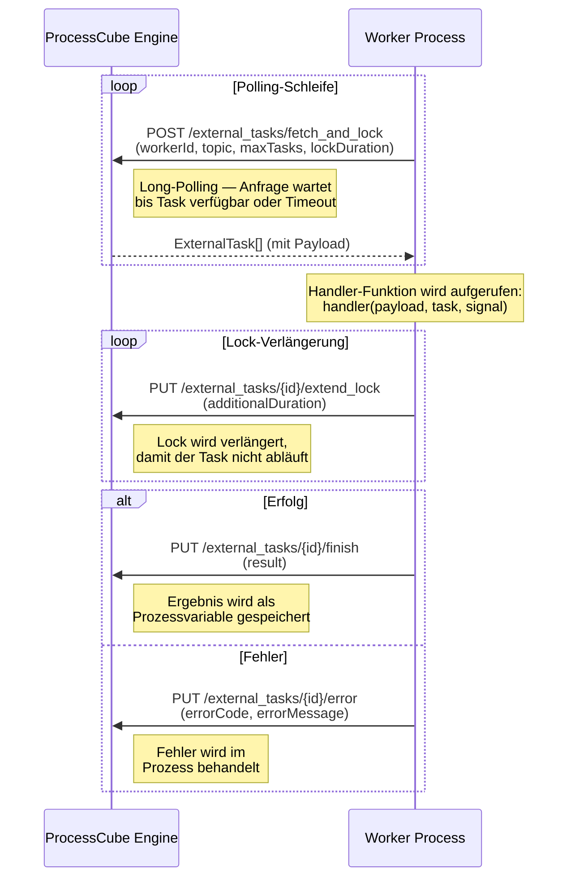
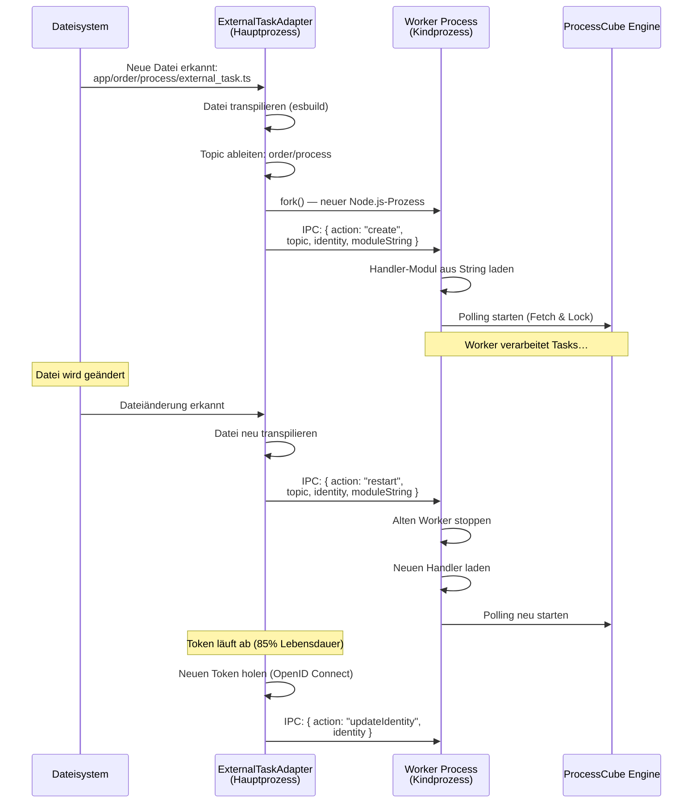
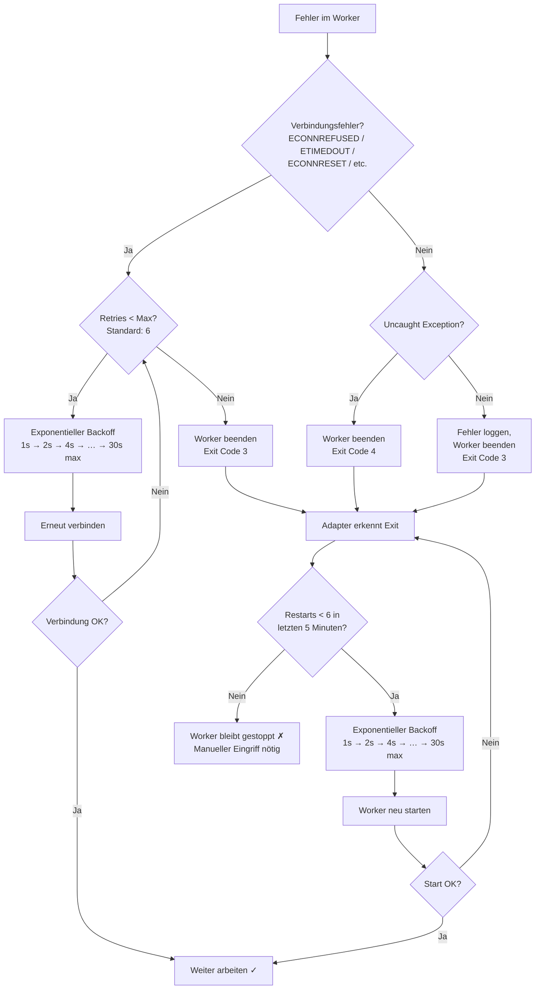
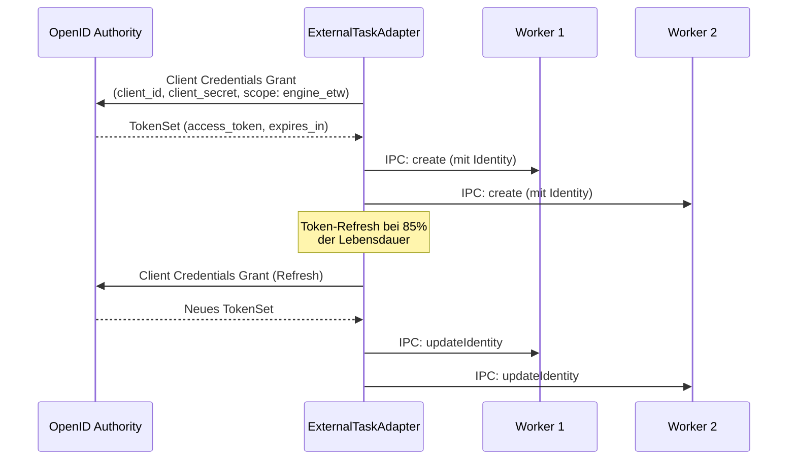

# ProcessCube.App.SDK

Das SDK beinhaltet Komponenten und Funktionen für Frontend und Backend (Client/Server) zur einfachen und schnellen Entwicklung einer ProcessCube App auf Basis von [Next.js](https://nextjs.org/).

## Installation zur Verwendung

### Voraussetzungen

- NodeJS `>= v24`

```shell
npm i @5minds/processcube_app_sdk
```

## Benutzung

Das NPM Paket hat _drei_ Exports.

### Default/Common

Hier werden Komponenten und Funktionen exportiert, die im Client und Server genutzt werden können.

Zum Beispiel die React Komponente RemoteUserTask:

```javascript
import { RemoteUserTask } from '@5minds/processcube_app_sdk';
```

### Server

Hier steht alles ausschließlich für eine serverseitige Umgebung zur Verfügung. Dazu zählen Funktionen, die mit der Engine arbeiten, oder React Komponenten, die Serverseitig gerendert werden können.

Beispiel:

```javascript
import { startProcess } from '@5minds/processcube_app_sdk/server';
```

Um die Engine URL anzupassen, die von den exportierten Funktionen genutzt wird, muss `PROCESSCUBE_ENGINE_URL` als Umgebungsvariable gesetzt werden. Andernfalls wird localhost mit dem Standardport der Engine genutzt `10560`.

### Client

Es können nur Komponenten und Funktionen importiert werden, die im Browser funktionieren. Zum Beispiel React Komponenten, die einen clientseitigen Router und dessen React Hooks nutzen oder Funktionen, die auf `window` oder generell globale Browser APIs zugreifen möchten.

```javascript
import { DynamicLink } from '@5minds/processcube_app_sdk/client';
```

### External Tasks

External Tasks ermöglichen es, eigene Geschäftslogik in einer Next.js App auszuführen, die von der ProcessCube Engine als Aufgabe vergeben wird. Erreicht ein BPMN-Prozess einen External Service Task, veröffentlicht die Engine diesen unter einem **Topic**. Ein passender Worker in der App holt sich den Task ab, verarbeitet ihn und gibt das Ergebnis zurück.

Das App SDK übernimmt dabei die komplette Infrastruktur: Worker-Prozesse werden automatisch gestartet, überwacht und bei Fehlern neu gestartet. Der Entwickler schreibt nur die eigentliche Handler-Funktion.

#### Architektur

Das folgende Diagramm zeigt die drei beteiligten Schichten und ihre Kommunikation:

```mermaid
graph LR
  subgraph ProcessCube Engine
    E[Engine]
  end

  subgraph Next.js App – Hauptprozess
    A[ExternalTaskAdapter]
    W[File Watcher]
    T[Token Management]
  end

  subgraph Eigener Node.js Prozess je Topic
    WP1[Worker Process<br/>Topic: order/process]
    WP2[Worker Process<br/>Topic: invoice/send]
  end

  E -- "HTTP: Fetch & Lock /<br/>Finish / Error /<br/>Extend Lock" --> WP1
  E -- "HTTP: Fetch & Lock /<br/>Finish / Error /<br/>Extend Lock" --> WP2

  A -- "IPC: create / restart /<br/>updateIdentity" --> WP1
  A -- "IPC: create / restart /<br/>updateIdentity" --> WP2

  W -- "Dateiänderung erkannt" --> A
  T -- "Token-Refresh" --> A
```

**Hauptkomponenten:**

| Komponente                    | Aufgabe                                                                                                                                                           |
| ----------------------------- | ----------------------------------------------------------------------------------------------------------------------------------------------------------------- |
| **ExternalTaskAdapter**       | Läuft im Hauptprozess der Next.js App. Überwacht das Dateisystem, startet Worker-Prozesse, verwaltet Tokens und koordiniert Restarts.                             |
| **ExternalTaskWorkerProcess** | Eigenständiger Node.js-Kindprozess (einer pro Topic). Lädt den transpilierten Handler, verbindet sich per HTTP-Long-Polling mit der Engine und verarbeitet Tasks. |
| **ProcessCube Engine**        | Verwaltet BPMN-Prozesse und vergibt External Tasks an Worker über das Fetch-and-Lock-Protokoll.                                                                   |

#### Lebenszyklus eines External Tasks

Das folgende Sequenzdiagramm zeigt, wie ein External Task von der Engine zum Worker gelangt, verarbeitet und abgeschlossen wird:



**Ablauf im Detail:**

1. Der Worker pollt die Engine per HTTP-Long-Polling nach neuen Tasks für sein Topic.
2. Sobald ein Task verfügbar ist, sperrt die Engine ihn (Lock) und liefert ihn mit dem Payload aus.
3. Der Worker ruft die Handler-Funktion auf und übergibt Payload, Task-Metadaten und ein AbortSignal.
4. Während der Verarbeitung verlängert der Worker automatisch den Lock, damit die Engine den Task nicht vorzeitig freigibt.
5. Nach Abschluss meldet der Worker das Ergebnis (Finish) oder einen Fehler (Error) an die Engine.

#### Worker-Startup und IPC-Kommunikation

Das App SDK startet pro `external_task.ts`-Datei einen eigenen Node.js-Kindprozess. Die Kommunikation zwischen Hauptprozess (Adapter) und Kindprozess (Worker) läuft über IPC (Inter-Process Communication):



**IPC-Nachrichten:**

| Action           | Richtung         | Beschreibung                                                                       |
| ---------------- | ---------------- | ---------------------------------------------------------------------------------- |
| `create`         | Adapter → Worker | Initialer Start: Übergibt Topic, Identity und transpilierten Handler-Code          |
| `restart`        | Adapter → Worker | Hot-Reload: Stoppt den alten Worker und startet mit neuem Code (gleiche Worker-ID) |
| `updateIdentity` | Adapter → Worker | Aktualisiert den Auth-Token auf dem laufenden Worker                               |

#### Fehlerbehandlung und Restart-Strategie

Das System hat zwei Ebenen der Fehlerbehandlung: im Worker-Prozess selbst und im Adapter (Hauptprozess).



**Worker-Level (Kindprozess):**

- Bei Verbindungsfehlern (ECONNREFUSED, ECONNRESET, ETIMEDOUT, ENOTFOUND, EAI_AGAIN, Socket Hang Up) versucht der Worker bis zu **6 Reconnects** mit exponentiellem Backoff (1s → 2s → 4s → 8s → 16s → 30s max).
- Die Anzahl der Retries ist über die Umgebungsvariable `PROCESSCUBE_APP_SDK_ETW_RETRY` konfigurierbar.
- Nach Ausschöpfung der Retries beendet sich der Worker mit Exit Code 3.
- Bei unbehandelten Exceptions beendet sich der Worker mit Exit Code 4.

**Adapter-Level (Hauptprozess):**

- Erkennt der Adapter einen Worker-Exit mit Code 3 oder 4, wird ein Neustart versucht.
- Maximal **6 Neustarts** innerhalb eines **5-Minuten-Fensters** sind erlaubt.
- Die Backoff-Zeiten steigen exponentiell: 1s → 2s → 4s → 8s → 16s → 30s.
- Wird das Limit erreicht, bleibt der Worker gestoppt — ein manueller Eingriff (z.B. App-Neustart) ist nötig.
- Nach Ablauf des 5-Minuten-Fensters wird der Zähler zurückgesetzt.

#### Setup und Konfiguration

##### 1. Next.js Plugin aktivieren

In der `next.config.js` wird das SDK-Plugin eingebunden und External Tasks aktiviert:

```javascript
// next.config.js
const { withApplicationSdk } = require('@5minds/processcube_app_sdk/server');

module.exports = withApplicationSdk({
  applicationSdk: {
    useExternalTasks: true,
    // Optional: Eigenes Verzeichnis für External Tasks
    // customExternalTasksDirPath: './my-tasks',
  },
});
```

Das Plugin erkennt automatisch, ob die App im Development- oder Production-Modus läuft, und startet die Worker entsprechend. Während des Build-Prozesses (`next build`) werden keine Worker gestartet.

##### 2. Handler-Datei anlegen

External Tasks werden durch Dateien mit dem Namen `external_task.ts` (oder `.js`) definiert. Das Verzeichnis, in dem die Datei liegt, bestimmt automatisch das **Topic**, unter dem sich der Worker bei der Engine registriert.

```
app/
├── order/
│   └── process/
│       └── external_task.ts    → Topic: order/process
├── invoice/
│   └── send/
│       └── external_task.ts    → Topic: invoice/send
└── notification/
    └── email/
        └── external_task.ts    → Topic: notification/email
```

Das SDK sucht Handler-Dateien standardmäßig in `./app` oder `./src/app`. Ein eigenes Verzeichnis kann über `customExternalTasksDirPath` konfiguriert werden.

> **Wichtig:** Pro Verzeichnis darf nur eine `external_task.ts` oder `external_task.js` existieren. Beide Dateien im selben Verzeichnis führen zu einem Fehler.

#### Handler-Signatur

Der Handler wird als **Default-Export** der Datei definiert. Er erhält bis zu drei Parameter:

```typescript
export default async function handleExternalTask(payload: any, task: ExternalTask<any>, signal: AbortSignal) {
  // Geschäftslogik hier
  return { result: 'done' };
}
```

| Parameter | Typ                 | Beschreibung                                                                                                                                                                             |
| --------- | ------------------- | ---------------------------------------------------------------------------------------------------------------------------------------------------------------------------------------- |
| `payload` | `any`               | Die Prozessvariablen, die der BPMN-Prozess dem External Task mitgibt. Enthält die im Prozessmodell definierte Payload-Expression.                                                        |
| `task`    | `ExternalTask<any>` | Metadaten des Tasks: `id`, `workerId`, `topic`, `correlationId`, `processInstanceId`, `processDefinitionId`, `flowNodeInstanceId`, `lockExpirationTime`, `state`, `createdAt`. Optional. |
| `signal`  | `AbortSignal`       | Wird ausgelöst, wenn ein Boundary Event (z.B. Timer) den Task abbricht. Optional.                                                                                                        |

**Rückgabewert:** Das zurückgegebene Objekt wird als Ergebnis an die Engine gemeldet und steht im BPMN-Prozess als Variable zur Verfügung.

#### Worker-Konfiguration

Über einen benannten `config`-Export können Worker-Einstellungen pro Handler angepasst werden:

```typescript
import { ExternalTaskConfig } from '@5minds/processcube_app_sdk/server';

export const config: ExternalTaskConfig = {
  lockDuration: 5000, // Lock-Dauer in ms (Standard: 30000)
  maxTasks: 5, // Gleichzeitige Tasks pro Polling-Zyklus (Standard: 10)
};
```

| Option         | Typ      | Standard | Beschreibung                                                                                                                                               |
| -------------- | -------- | -------- | ---------------------------------------------------------------------------------------------------------------------------------------------------------- |
| `lockDuration` | `number` | `30000`  | Dauer in Millisekunden, für die ein Task gesperrt wird. Bestimmt auch das Intervall der Lock-Verlängerung und die maximale Verzögerung bei Abort-Signalen. |
| `maxTasks`     | `number` | `10`     | Maximale Anzahl gleichzeitig abgeholter Tasks pro Polling-Zyklus.                                                                                          |

#### Abort-Handling bei Boundary Events

Wenn ein BPMN Boundary Event (z.B. ein Timer oder Signal) einen External Task abbricht, löst die Engine den Abbruch beim nächsten Lock-Renewal aus. Das `AbortSignal` im Handler wird daraufhin ausgelöst.

**Wichtig:** Die `lockDuration` bestimmt die maximale Verzögerung bis zum Abort, da die Engine den Abbruch erst beim nächsten Lock-Renewal mitteilen kann:

| lockDuration       | Max. Verzögerung bis Abort |
| ------------------ | -------------------------- |
| `30000` (Standard) | bis zu 30 Sekunden         |
| `5000`             | bis zu 5 Sekunden          |
| `1000`             | bis zu 1 Sekunde           |

Für zeitkritische Abbrüche sollte die `lockDuration` entsprechend reduziert werden.

**Beispiel mit Abort-Handling:**

```typescript
import { ExternalTaskConfig } from '@5minds/processcube_app_sdk/server';

export const config: ExternalTaskConfig = {
  lockDuration: 5000,
};

export default async function handleExternalTask(payload: any, _task: any, signal: AbortSignal) {
  // Listener für Cleanup-Aktionen bei Abbruch
  signal.addEventListener(
    'abort',
    () => {
      console.log('Task wurde durch Boundary Event abgebrochen');
      // Hier ggf. Ressourcen freigeben
    },
    { once: true },
  );

  // Signal vor asynchronen Operationen prüfen
  if (signal.aborted) return;

  const result = await doWork(payload);

  // Signal nach asynchronen Operationen prüfen
  if (signal.aborted) return;

  return result;
}
```

#### Authentifizierung und Token-Management

Ist eine ProcessCube Authority konfiguriert, holt der Adapter automatisch Tokens per **OpenID Connect Client Credentials Grant** und verteilt sie an alle Worker.



- Der Token wird bei **85% seiner Lebensdauer** automatisch erneuert.
- Alle aktiven Worker erhalten den neuen Token per IPC-Nachricht.
- Der initiale Token-Abruf hat **10 Versuche** mit exponentiellem Backoff (max. 30s).
- Der periodische Token-Refresh versucht es **unbegrenzt** mit Backoff (max. 60s).
- Ist keine Authority konfiguriert, wird eine Dummy-Identity verwendet (für lokale Entwicklung ohne Auth).

#### Umgebungsvariablen

| Variable                                         | Pflicht        | Standard                 | Beschreibung                                                                             |
| ------------------------------------------------ | -------------- | ------------------------ | ---------------------------------------------------------------------------------------- |
| `PROCESSCUBE_ENGINE_URL`                         | Nein           | `http://localhost:10560` | URL der ProcessCube Engine                                                               |
| `PROCESSCUBE_AUTHORITY_URL`                      | Nein           | —                        | URL des OpenID-Providers. Wenn gesetzt, wird Token-basierte Authentifizierung aktiviert. |
| `PROCESSCUBE_EXTERNAL_TASK_WORKER_CLIENT_ID`     | Wenn Authority | —                        | Client-ID für den OpenID Client Credentials Grant                                        |
| `PROCESSCUBE_EXTERNAL_TASK_WORKER_CLIENT_SECRET` | Wenn Authority | —                        | Client-Secret für den OpenID Client Credentials Grant                                    |
| `PROCESSCUBE_APP_SDK_ETW_RETRY`                  | Nein           | `6`                      | Maximale Anzahl der Reconnect-Versuche im Worker-Prozess bei Verbindungsfehlern          |

#### Vollständiges Beispiel

Eine `external_task.ts` mit allen Features — Konfiguration, typisiertem Payload, Fehlerbehandlung und Abort-Support:

```typescript
import { ExternalTaskConfig } from '@5minds/processcube_app_sdk/server';

// Worker-Konfiguration
export const config: ExternalTaskConfig = {
  lockDuration: 5000, // 5s Lock für schnelle Abort-Reaktion
  maxTasks: 3, // Maximal 3 Tasks gleichzeitig
};

// Typen für Payload und Ergebnis
interface OrderPayload {
  orderId: string;
  customerEmail: string;
  items: Array<{ productId: string; quantity: number }>;
}

interface OrderResult {
  confirmationId: string;
  processedAt: string;
}

export default async function handleExternalTask(payload: OrderPayload, task: any, signal: AbortSignal): Promise<OrderResult | undefined> {
  console.log(`Verarbeite Bestellung ${payload.orderId} (Task: ${task.id})`);

  // Abort-Handler für Cleanup
  signal.addEventListener(
    'abort',
    () => {
      console.log(`Bestellung ${payload.orderId} wurde abgebrochen`);
    },
    { once: true },
  );

  if (signal.aborted) return;

  // Geschäftslogik
  const confirmation = await processOrder(payload);

  if (signal.aborted) return;

  await sendConfirmationEmail(payload.customerEmail, confirmation);

  if (signal.aborted) return;

  return {
    confirmationId: confirmation.id,
    processedAt: new Date().toISOString(),
  };
}
```

#### Hot-Reload

Im Development-Modus überwacht das SDK die Handler-Dateien per File-Watcher. Änderungen an einer `external_task.ts` werden automatisch erkannt: Die Datei wird neu transpiliert und der Worker per IPC-Nachricht (`restart`) mit dem neuen Code neu gestartet — ohne die App neu starten zu müssen. Die Worker-ID bleibt dabei erhalten.

## Wie kann ich das Projekt aufsetzen?

### Setup/Installation

Das SDK wird über den Node Paketmanager `npm` gebaut.

Für das Installieren und Bauen können folgende Befehle benutzt werden:

```shell
npm ci
npm run build
```

Für ein Productionbuild:

```shell
npm run build:prod
```

Um mit dem Paket lokal zu arbeiten, kann es mit npm in ein anderes Projekt verlinkt werden:

```shell
npm link
npm run watch
```

Im Zielprojekt anschließend:

```shell
npm link @5minds/processcube_app_sdk
```

Bei Problemen mit React muss ggf. noch die React Dependency des Zielprojekts zurück in das SDK gelinkt werden, damit nur eine React Instanz zur Laufzeit existiert:

```shell
npm link <path-to-project>/node_modules/react
```
