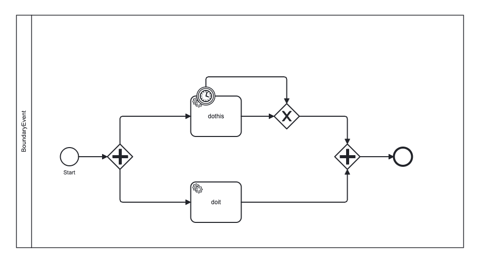

# Testbericht: External Task Worker — Abort bei Timer Boundary Events

**Datum:** 13.02.2026
**SDK-Version:** 8.2.2
**Engine-Version:** 18.6.8
**Tester:** Automatisiert (Claude Code)

---

## 1. Zusammenfassung

Dieser Test verifiziert, dass ein External Task Worker seine laufende Arbeit **frühzeitig abbricht**, wenn ein Timer Boundary Event den zugehörigen Task in der Engine beendet.

**Ergebnis: BESTANDEN** — Der Worker erkennt die Beendigung durch das Boundary Event innerhalb von ~1 Sekunde und bricht die Handler-Ausführung sauber ab.

---

## 2. Hintergrund

### Problem

Die ProcessCube Engine sendet keine aktive Push-Benachrichtigung an Worker, wenn ein Boundary Event einen External Task beendet. Standardmäßig bemerkt ein Worker dies erst bei seinem nächsten API-Aufruf an die Engine — entweder beim `ExtendLock` oder beim `finishExternalTask`.

### Lösung: Reduzierte `lockDuration`

Mit der Standard-`lockDuration` von 30.000 ms wird der Lock erst nach 25 Sekunden erneuert (`lockDuration - 5000ms`). Das ist für zeitkritische Boundary Events viel zu spät.

**Durch Setzen von `lockDuration: 5000` wird der ExtendLock-Intervall auf ~1 Sekunde reduziert:**

```
ExtendLock-Intervall = max(lockDuration - 5000, 1000) = max(0, 1000) = 1000 ms
```

Der Worker prüft damit jede Sekunde, ob der Task noch existiert. Wurde er durch ein Boundary Event beendet, antwortet die Engine mit einem **GoneError (410)**, woraufhin der Worker das **AbortSignal** auslöst.

---

## 3. Testprozess (BPMN)



Der Prozess `BoundaryEvent_Process` besteht aus:

| Element                  | Typ                             | Beschreibung                                |
| ------------------------ | ------------------------------- | ------------------------------------------- |
| **Start**                | Start Event                     | Startet den Prozess                         |
| **Parallel Gateway**     | Fork                            | Verzweigt in zwei parallele Pfade           |
| **dothis**               | External Task (Topic: `dothis`) | Simuliert eine 10-Sekunden-Aufgabe          |
| **Timer Boundary Event** | Timer (PT5S)                    | Feuert nach 5 Sekunden und beendet `dothis` |
| **doit**                 | External Task (Topic: `doit`)   | Sofort abgeschlossene Aufgabe               |
| **Exclusive Gateway**    | Merge                           | Vereint Normal- und Boundary-Pfad           |
| **Parallel Gateway**     | Join                            | Wartet auf beide Pfade                      |
| **End Event**            | Ende                            | Prozess abgeschlossen                       |

**Erwartetes Verhalten:** Der Timer Boundary Event feuert nach 5 Sekunden und beendet den `dothis`-Task, bevor dessen 10-Sekunden-Delay abläuft. Der Worker soll dies erkennen und seine Ausführung abbrechen.

---

## 4. Handler-Code

### dothis/external_task.ts (mit Abort-Unterstützung)

```typescript
function delay(ms: number, signal?: AbortSignal) {
  return new Promise<void>((resolve, reject) => {
    if (signal?.aborted) {
      reject(new Error('Aborted'));
      return;
    }

    const timer = setTimeout(resolve, ms);

    signal?.addEventListener(
      'abort',
      () => {
        clearTimeout(timer);
        reject(new Error('Aborted'));
      },
      { once: true },
    );
  });
}

export const config = {
  lockDuration: 5000, // Lock alle 5s erneuern — ermöglicht schnellen Abort bei Boundary Events
};

export default async function handleExternalTask(payload: any, _task: any, signal: AbortSignal) {
  console.log('External Task received:', payload);

  // Synchroner Listener — wird vor process.exit(3) ausgeführt
  signal.addEventListener(
    'abort',
    () => {
      console.log('External Task aborted — Boundary Event hat den Task beendet');
    },
    { once: true },
  );

  try {
    await delay(10_000, signal);
  } catch (e) {
    console.log('External Task aborted during delay');
    return;
  }

  if (signal.aborted) return;

  console.log('External Task finished:', payload);
  return { success: true, processedAt: new Date().toISOString() };
}
```

### Wichtige Aspekte des Codes

1. **`config.lockDuration: 5000`** — Reduziert den ExtendLock-Intervall auf ~1 Sekunde. Dies ist der entscheidende Parameter für schnelle Abort-Erkennung.

2. **AbortSignal-fähige `delay()`-Funktion** — Der Timer wird beim Abort sofort gecancelt, statt 10 Sekunden abzuwarten.

3. **Synchroner Abort-Listener** — Der `signal.addEventListener('abort', ...)` Callback wird synchron ausgeführt, bevor der Worker-Prozess sich beendet. Dies stellt sicher, dass die Log-Ausgabe auch bei schnellem Process-Exit sichtbar ist.

4. **Doppelte Absicherung** — Sowohl der Abort-Listener als auch die `signal.aborted`-Prüfung nach dem `await` verhindern, dass unnötige Arbeit nach einem Boundary Event ausgeführt wird.

---

## 5. Konfigurationsempfehlung: `lockDuration`

| lockDuration             | ExtendLock-Intervall | Abort-Erkennung      | Empfehlung                                    |
| ------------------------ | -------------------- | -------------------- | --------------------------------------------- |
| **30.000 ms** (Standard) | 25.000 ms            | Bis zu 25s verzögert | Nur wenn keine Boundary Events genutzt werden |
| **10.000 ms**            | 5.000 ms             | Bis zu 5s verzögert  | Guter Kompromiss für die meisten Prozesse     |
| **5.000 ms**             | 1.000 ms             | Bis zu 1s verzögert  | Ideal bei Timer Boundary Events               |

**Hinweis:** Eine niedrigere `lockDuration` erzeugt mehr API-Aufrufe an die Engine. Für die meisten Anwendungsfälle ist `5000` ein guter Wert, da der Overhead minimal ist (ein leichtgewichtiger HTTP-Request pro Sekunde).

---

## 6. Testergebnis

### Testdurchführung (13.02.2026, 23:10:27 Uhr)

**Prozessinstanz:** `cefcb3f5-1221-48c0-a6ee-9eb7b2b4920e`

### Zeitverlauf

| Zeit (UTC)   | Sekunde | Ereignis                                                      |
| ------------ | ------- | ------------------------------------------------------------- |
| 22:10:27.257 | +0,0s   | `doit` Task empfangen und sofort abgeschlossen                |
| 22:10:27     | +0,0s   | `dothis` Task empfangen — `External Task received: {}`        |
| 22:10:28.255 | +1,0s   | ExtendLock #1 — OK                                            |
| 22:10:29.271 | +2,0s   | ExtendLock #2 — OK                                            |
| 22:10:30.292 | +3,0s   | ExtendLock #3 — OK                                            |
| 22:10:31.311 | +4,0s   | ExtendLock #4 — OK                                            |
| 22:10:32.332 | +5,1s   | ExtendLock #5 — **GoneError (410)**                           |
| 22:10:32.339 | +5,1s   | `External Task aborted — Boundary Event hat den Task beendet` |
| 22:10:32.339 | +5,1s   | AbortSignal ausgelöst, Executor disposed                      |
| 22:10:32.354 | +5,1s   | Worker-Prozess beendet (Exit Code 3)                          |
| 22:10:32.355 | +5,1s   | Automatischer Restart geplant (in 1000ms)                     |

### Ablaufbeschreibung

1. **Prozessstart (T+0s):** Beide parallelen Pfade werden gestartet. Der `doit`-Task wird sofort abgeschlossen. Der `dothis`-Task beginnt seinen 10-Sekunden-Delay.

2. **ExtendLock-Zyklus (T+1s bis T+4s):** Der Worker erneuert den Lock erfolgreich jede Sekunde. Die Engine bestätigt, dass der Task noch aktiv ist.

3. **Boundary Event feuert (T+5s):** Der Timer Boundary Event feuert nach 5 Sekunden. Die Engine beendet den `dothis`-Task und leitet den Prozessfluss über den Boundary-Pfad um.

4. **Abort-Erkennung (T+5,1s):** Beim nächsten ExtendLock (< 1 Sekunde nach dem Boundary Event) antwortet die Engine mit **GoneError (410)**. Der Worker erkennt, dass der Task nicht mehr existiert.

5. **Sauberer Abort (T+5,1s):** Das AbortSignal wird ausgelöst. Der Handler beendet seine Ausführung sofort. Der Worker-Prozess beendet sich mit Exit Code 3.

6. **Automatischer Restart (T+6,1s):** Der ExternalTaskAdapter plant automatisch einen Neustart des Workers nach 1 Sekunde, sodass er für den nächsten Task bereit ist.

---

## 7. Log-Auszug

```
External Task received: {}

[debug] Extending Lock on External Task ef8ce6e7... (topic: dothis)      -- T+1s
[debug] Extending Lock on External Task ef8ce6e7... (topic: dothis)      -- T+2s
[debug] Extending Lock on External Task ef8ce6e7... (topic: dothis)      -- T+3s
[debug] Extending Lock on External Task ef8ce6e7... (topic: dothis)      -- T+4s
[debug] Extending Lock on External Task ef8ce6e7... (topic: dothis)      -- T+5s

[debug] HTTP Response: GoneError (410)
        "External Task with ID ef8ce6e7... has been finished and is not accessible."

[error] External task worker for topic dothis ran into an error
        errorType: extendLock
        error: GoneError (410)

External Task aborted — Boundary Event hat den Task beendet

[debug] Abort Signal has been triggered for External Task Executor ef8ce6e7...
[debug] Disposing Executor for External Task ef8ce6e7...
[debug] Disposing automatic Lock Extension for External Task ef8ce6e7...

[info]  External Task Worker process exited for dothis (code: 3)
[info]  Scheduling restart for dothis in 1000ms (attempt 1/6)
```

---

## 8. Bewertung

| Kriterium                           | Ergebnis                                            |
| ----------------------------------- | --------------------------------------------------- |
| Boundary Event wird erkannt         | BESTANDEN — GoneError (410) bei ExtendLock          |
| AbortSignal wird ausgelöst          | BESTANDEN — Signal feuert synchron                  |
| Handler-Ausführung wird abgebrochen | BESTANDEN — 10s-Delay nach ~5s beendet              |
| Console-Ausgabe sichtbar            | BESTANDEN — Synchroner Abort-Listener loggt korrekt |
| Worker startet automatisch neu      | BESTANDEN — Restart nach 1s geplant                 |
| Abort-Latenz                        | ~0,1s nach Boundary Event (1 ExtendLock-Zyklus)     |
| Keine Ressourcen-Leaks              | BESTANDEN — Timer gecancelt, Executor disposed      |

---

## 9. Fazit

Der External Task Worker erkennt Timer Boundary Events zuverlässig über den ExtendLock-Mechanismus. Die Konfiguration `lockDuration: 5000` ist der Schlüssel für eine schnelle Abort-Erkennung (< 1 Sekunde). Der AbortSignal-Mechanismus im Handler-Code ermöglicht eine saubere Unterbrechung laufender Operationen.

### Empfehlungen für Entwickler

1. **`lockDuration` anpassen**, wenn Boundary Events im Prozess verwendet werden:

   ```typescript
   export const config = {
     lockDuration: 5000,
   };
   ```

2. **AbortSignal im Handler nutzen**, um lang laufende Operationen unterbrechbar zu machen (z.B. HTTP-Requests, Datenbank-Abfragen, Timer).

3. **Synchrone Abort-Listener** verwenden, wenn Log-Ausgaben beim Abort garantiert sichtbar sein sollen.
